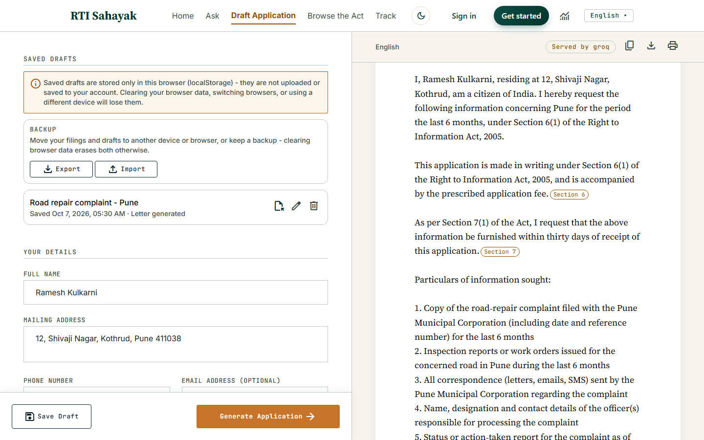

# RTI Sahayak

Drafts a Right to Information Act, 2005 application from a citizen's plain-language
problem description. Every procedural claim in the letter (filing manner, fee, response
timeline) is grounded in retrieved Act text and cited by section; the department guess is
always labeled as a guess. It declines to draft only when the request itself isn't asking
for a record — not when the topic happens to share no vocabulary with the statute, which
is most legitimate requests.

**Demo video:** [add link here]
**Live deployment:** [add Vercel URL here]
**Sample application (no LLM/Chroma required):** `<deployment URL>/demo`

## The problem

Filing an RTI application means citing specific sections of a 20-year-old statute correctly,
and most citizens have never read it. Get the procedure wrong — the wrong fee, a missing
citation, the wrong Public Information Officer — and the application can be rejected or
delayed on a technicality that has nothing to do with the actual grievance.

## Screenshot

A generated draft, with clause-level citation chips (linking each procedural sentence back
to the Act section that justifies it) and the retrieved source passages shown below:



## Architecture

```
agent/    intake slot-filling (agent/intake.py), letter drafting/composition
          (agent/drafter.py) - the LLM scope classification and procedural
          clause-provenance logic both live here - and statutory deadline
          grounding for Track (agent/deadlines.py)
rag/      corpus ingestion (rag/ingest.py) and retrieval (rag/retriever.py) -
          the Chroma vector store and its embedding function
llm/      provider-agnostic LLM client (llm/client.py) - a configurable, ordered
          provider chain (default: Groq -> Gemini -> Anthropic, see below),
          automatic retry on the next provider in the chain if one fails
export/   PDF generation (export/pdf_writer.py) - renders the final letter text,
          nothing else
web/      FastAPI app: routes (web/main.py), the /api/draft, /api/ask, /api/act,
          and /api/track/deadline-rules endpoints (web/api/), Jinja2 templates,
          per-IP rate limiting
index.py  Vercel entrypoint - re-exports web.main:app
```

A request flows: **web/api/draft.py** (intake fields) → **CHECK A** (`agent/drafter.py`'s
`gather_grounding()`, via `rag/retriever.py`) → **CHECK B** (`agent/drafter.py`'s
`understand_request()`, via `llm/client.py`) → **agent/drafter.py**'s `compose_letter()`
(procedural clauses assembled in plain Python, department guess and information-sought from
the LLM) → **export/pdf_writer.py** on download.

### LLM provider chain

`llm/client.py`'s `generate()`/`generate_stream()` walk an ordered `PROVIDER_CHAIN` -
if one provider fails, the next is tried automatically, with the same `LLMError` type
and the same fallback semantics regardless of which providers are in play. This is the
code's own default when nothing overrides it; the deployed instance runs a different,
explicit order (`groq,anthropic,gemini` - see Deployment) for cost reasons, not because
this default changed. Default chain, in order:

1. **Groq** (`openai/gpt-oss-120b`) - primary. Free tier, 30 RPM / 1,000 RPD.
2. **Gemini** (`gemini-flash-latest`) - burst absorber, not a safety net. Free tier is a
   hard 20 requests/day (see Known limitations) - fine for absorbing a short burst that
   trips Groq's per-minute cap, not for a sustained session.
3. **Anthropic** (`claude-haiku-4-5-20251001`) - paid, no free-tier daily cap. The
   provider a Groq/Gemini outage or throttle can no longer turn into a hard failure
   against. Haiku is used because CHECK B classification and `/ask` Q&A are both small,
   structured JSON-output calls - no prompt changes were needed to move this app's
   existing "respond with ONLY a JSON object" design onto Claude; confirmed both by
   design (the response parser's markdown-fence stripping was already provider-agnostic)
   and empirically (a real call through `understand_request()`, forced onto an
   Anthropic-only chain, parsed cleanly on the first try).

`LLM_PROVIDER` (existing config) sets `chain[0]`, with the other two providers filling
in behind it in default order - existing `LLM_PROVIDER=groq` setups keep working
unchanged. `LLM_PROVIDER_CHAIN` (comma-separated, e.g. `anthropic,groq,gemini`) fully
overrides the order, for promoting Anthropic to primary or any other arrangement.

### Chunking

`rag/ingest.py` chunks each Act section on its own boundary - a section becomes one
chunk when its full text is under `CHUNK_MAX_CHARS` (1800), and a longer section is
sub-split into ~1200-char windows (`_split_oversized_segment`, snapped to the nearest
word boundary, 150-char overlap between pieces) that all carry the same section label.
83 chunks total from the Act's 31 numbered sections plus its Preamble.

**Section 7 is a deliberate, targeted exception to that general windowing.** A citizen
question this app should answer easily - *"what happens if the PIO misses the
deadline?"* - was retrieving nothing useful: Section 7(6), the fee-waiver provision
(arguably the single most useful sentence in the Act for an ordinary citizen), was
ranking 46th of 78 chunks. The cause wasn't retrieval tuning - it was mislabeling.
`_split_oversized_segment`'s blind character windows had put (6)'s actual text in the
same ~1200-char chunk as unrelated sub-section (4)/(5) content (disability-access
assistance, printed/electronic-format fee mechanics); a chunk's embedding is an average
over everything in it, so (6)'s own topic was diluted by text that had nothing to do
with it.

The fix (`_split_section_7_at_subsections`) gives Section 7 - and only Section 7 - one
chunk per top-level sub-section, (1) through (9), instead of character windows. Every
other section's chunking is untouched: diffed the full before/after chunk set to
confirm it - 78 → 83 chunks, Section 7's count changed (4 → 9), every other section's
chunks are byte-for-byte identical. A corpus-wide version of this fix (chunking every
oversized section at its own sub-section boundaries, not just Section 7) was considered
and deliberately not taken - Sections 2, 4, 16, and 19 are all *larger* than Section 7
and would all be affected, including Section 19, which currently ranks appeal questions
very well (distance 0.38) and had nothing to gain from being touched. The blast radius
of a general change wasn't worth it for a fix that only Section 7 needed.

This bought real improvement without full correctness - see the Section 7(6) note in
Known limitations for where it still falls short, and why that gap was left as an
honestly-documented regression case rather than forced.

## The two-check grounding design

This is the most important design decision in the project, and it went through two
iterations - the first one was wrong in a way that's worth explaining, because the failure
mode is easy to reach for.

**The obvious approach, and why it doesn't work.** The natural instinct is to check whether
the Act's text is actually relevant to what the citizen typed - embed their problem
description, retrieve the nearest chunks from the Act, and refuse if nothing scores close
enough. This is what an earlier version of this app did, using the same distance threshold
already tuned for retrieval quality (0.75).

It's the wrong question. The RTI Act, 2005 is a procedural statute: Section 3 grants an
unconditional right to information, Section 6 lets any citizen request any record from any
public authority without stating a reason, and Section 8 lists a short, specific set of
exemptions (national security, cabinet papers, personal privacy) - none of them topic-based.
The Act's own text never mentions ration cards, roads, or pensions by name, because it was
never meant to. Coverage is near-universal by design; there's no "does the Act cover this
topic" question that retrieval distance could sensibly answer, because almost everything is
covered and the statute doesn't say so per-topic.

In practice this produced two failure modes at once, both confirmed empirically:
- **False refusals.** "My ration card renewal is stuck with no update" - an extremely
  common, obviously legitimate RTI request - retrieved nothing under the threshold at all,
  because "ration card" shares no vocabulary with the Act's procedural language.
- **Meaningless false positives.** "My pension payments have stopped without explanation"
  passed the gate not because the Act says anything about pensions, but because it happened
  to score under 0.75 against **Section 16** - the term-of-office rules for State
  Information Commissioners. The letter would have gone out grounded in a coincidence, not
  a reason.

**The fix: separate the two questions actually being asked, and answer each with the tool
suited to it.**

- **CHECK A - procedural grounding (deterministic).** Does the corpus actually contain the
  procedural text that backs the Section 6/7 clauses and the citation chips? This runs
  `gather_grounding()`'s two fixed retrieval queries (filing manner + fee, response
  timeline) - unrelated to the citizen's topic, so it succeeds for every real request against
  a healthy corpus and only fails if Chroma itself is empty or broken (e.g. a deploy that
  skipped ingestion). It's not a relevance filter; it's a corpus-health check, and it's
  cheap enough to run before any LLM call.
- **CHECK B - scope (LLM classification, explicit verdict).** Is this genuinely a request
  for records held by an Indian public authority? Semantic similarity to the Act's own text
  can't answer this, so it isn't inferred from retrieval distance, and it isn't inferred
  from the LLM's `information_sought` list coming back empty either - a truncated
  completion or a provider hiccup would look identical to a genuine "not a records request"
  answer otherwise. The model returns an explicit `{"in_scope": true|false, "reason": "..."}`
  verdict alongside the drafting fields, and the three resulting states are handled
  separately: `true` drafts normally, `false` shows an out-of-scope screen with the model's
  stated reason, and *no verdict obtained* (a parse failure or provider error, distinct from
  an explicit `false`) fails open - the letter is still drafted, with a visible warning that
  scope screening was unavailable, on the reasoning that procedural grounding (CHECK A)
  already held and a mysterious refusal during a live demo is worse than a flagged draft.

The regression suite (`tools/scope_regression_suite.py`) exists specifically to keep this
honest: it includes a deliberately adjacent pair - *"how do I file my income tax
return"* (out of scope: a how-to question) versus *"certified copy of my income tax return
filed for AY 2023-24"* (in scope: a specific record) - that semantic distance to the Act's
text could never have separated, because both sit in the same topic neighborhood. Splitting
the check by *what kind of question it answers*, rather than tuning one threshold harder,
is what made that distinction possible.

## Evaluation

**Limits first, not last:** this is 113 hand-written cases, self-labelled by the same
people who built the system being measured, one annotator, no inter-annotator agreement.
Several slices (Hindi n=10, Marathi n=10, `opinion_prediction` n=10, `service_request`
n=10) are too small to distinguish a real 0.90 from an observed 1.00. Full dataset,
labelling convention, and every contested judgment call are in `tools/eval/README.md`.
An evaluation that overstates its own authority is worse than no evaluation - treat
every number below as directional evidence from a small, self-authored set, not a proof.

**The finding, stated precisely:** the retrieval-distance gate this project replaced
(Gates 4-5) was not conservative - it was **lenient in the wrong direction**. Reconstructed
faithfully from git history (`tools/eval/old_gate.py`, calling today's unchanged
`retrieve()`) and run on the identical 113 cases, it predicted `in_scope` on **67.3%** of
requests against an actual base rate of 53.1% - more often than the new design (58.4%),
not less. It said yes more often *and* was wrong more often, failing in both directions
at once: 17 legitimate grievances wrongly refused, 33 out-of-scope requests wrongly
drafted. "The old gate was strict but safe" is not what happened; "the old gate was
lenient for the wrong reason" is.

The reason is mechanical, not incidental: the gate measured whether the *citizen's own
words* scored close to the Act's *procedural* language. Those are different vocabularies
by design (the Act never says "ration card" or "streetlight"), so the same "nothing
retrieved" signal is produced equally by a legitimate grievance worded in plain language
and by a request that has nothing to do with the Act at all - checked directly: among the
37 cases where the old gate retrieved zero chunks, 17 were actually `in_scope` and 20
`out_of_scope`, a 46/54 split indistinguishable from chance on this sample.

| metric | new (two-check) | old (distance gate) |
|---|---|---|
| Precision | 0.909 | 0.566 |
| Recall | 1.000 | 0.717 |
| F1 | 0.952 | 0.632 |
| False refusal rate | **0.000** | 0.283 |
| Predicted in_scope rate | 0.584 | 0.673 |
| Confusion matrix | TP=60 FP=6 TN=47 FN=0 | TP=43 FP=33 TN=20 FN=17 |

By `case_type` (`grievance`, n=40, is the slice this redesign was built for):

| case_type | n | new | old |
|---|---|---|---|
| explicit_request | 20 | 100.0% | 100.0% |
| **grievance** | **40** | **100.0%** | **57.5%** |
| advice_seeking | 33 | 93.9% | 54.5% |
| opinion_prediction | 10 (underpowered) | 100.0% | 20.0% |
| service_request | 10 (underpowered) | 60.0% | 0.0% |

No slice, checked programmatically rather than assumed, favoured the old gate.

**The Hindi result, with its caveat attached:** the old gate's false refusal rate was
0.600 in Hindi versus 0.240 in English (Hindi n=10, English n=93 - the Hindi figure is
one wrong verdict away from being a different number, and is reported as a fairness
*observation warranting a larger sample*, not a proven effect). The direction is exactly
what you'd expect from an English-language procedural corpus measured by embedding
distance against non-English citizen text, and it would mean the old design failed
hardest for the citizens with the least alternative recourse - but n=10 cannot carry
that claim on its own, and isn't asked to here.

**Our own weaknesses, not just the win:**

- **`service_request` is the new design's worst slice at 60% (n=10, underpowered).** The
  failure mode is specific and worth naming plainly: CHECK B checks whether a request
  *sounds* record-shaped, not whether the record could plausibly exist or the target is
  a real public authority. It drafted requests for a private company's internal audit, a
  private hospital's staff salaries, and an inspection report for construction that
  hasn't started yet. This is the mirror image of the adversarial-pair design and the
  hardest direction for an LLM classifier - confirmed, not merely predicted.
- **The +5.3-point lean toward `in_scope` (58.4% predicted vs. 53.1% base rate) is a
  deliberate trade, stated as one rather than excused:** a wrongly refused request blocks
  someone from exercising a legal right; a wrongly accepted one produces a letter they
  can read and discard. For a citizen-facing tool, erring toward drafting when uncertain
  is the trade this project chose to make, and the false-refusal-rate headline (0.000) is
  partly a function of that choice, not precision alone.
- **The contested-label sensitivity check cut against this project, which is what makes
  it worth reporting.** 16 cases ("how do I get my land mutated", and 15 more
  structurally identical) have a real, Section-4(1)(b)-grounded in-scope reading that the
  dataset deliberately did not adopt as primary (see `tools/eval/README.md`). Scoring all
  20 contested cases on their documented alternative reading instead makes the new design
  look *worse* - recall drops from 1.000 to 0.803, false refusal rate rises to 0.197 -
  because 14 of those 16 cases were already answered correctly under the primary
  convention. A relabelling that hurts your own numbers when you actually check it is
  stronger evidence the labelling convention is sound than one that would have helped.

**Future work - a cheap pre-filter is not one of them, and here's why:** the old gate
costs zero LLM calls; the new one spends one classification call per request (the same
call that also produces `information_sought`/`likely_authority`, not a pure tax on top of
drafting). The obvious cost-saving idea is a hybrid - use retrieval distance as a fast
pre-filter, call the LLM only in an uncertain band. Checked directly rather than assumed:
it doesn't work, because there is no confident band to filter on. The old gate's single
most "confident" signal - retrieving *zero* chunks at all - splits 17 `in_scope` to 20
`out_of_scope` on this set, statistically indistinguishable from a coin flip. A pre-filter
built on this signal wouldn't approximate CHECK B cheaply; it would reintroduce exactly
the false-refusal failure mode this project removed, for whatever fraction of traffic it
touched. (CHECK A already *is* the legitimate version of this pattern - a free,
deterministic check - but on corpus health, a signal that genuinely has no false-negative
band, not on scope.)

## Track and Save Draft (localStorage only)

Both `/track` (statutory deadline tracking) and Save Draft (on `/draft`) persist entirely
in the browser's `localStorage` - there is no server-side account, database, or per-user
storage behind either one. This is a deliberate constraint, not a missing feature:
serverless hosting has no durable local disk, and neither feature needs a database to be
useful. (Optional accounts exist - see Deployment - but they don't sync these.) Both pages disclose this plainly in the UI (a warning banner, not a
buried caveat) - clearing browser data, switching browsers, or using a different device
loses what's stored.

**Track** grounds all 5 deadlines it computes directly against the retrieved RTI Act
corpus, the same "verify before citing" discipline `agent/drafter.py` already used for the
letter's procedural clauses: Section 7(1)'s 30-day response, the 7(1) proviso's 48-hour
life/liberty deadline, Section 7(6)'s fee waiver on a missed deadline, Section 19(1)'s
30-day first appeal, and Section 19(3)'s 90-day second appeal (`agent/deadlines.py`). Each
rule is retrieved and keyword-verified independently; a rule that can't be verified is
omitted with a visible warning rather than shown anyway. The second appeal's true 90-day
window legally runs from when the *first appeal's own decision* was due (Section 19(6)),
which depends on when that appeal was actually filed - a date the tracker's form doesn't
collect - so rather than chaining a plausible-but-unsupported date from the original filing
date, it's shown as a cited, informational recourse note with no computed date once the
first-appeal deadline has also passed.

**Save Draft** persists the filled form and, if one was generated, the full letter
(application text, citation clauses, source chunks, warnings) under a derived title and
timestamp. Reloading a saved draft repopulates every form field and restores the letter
byte-identical, with citation chips and source cards intact - not regenerated, the exact
same response replayed through the same rendering code that first drew the chips.

Track and Save Draft intentionally use separate `localStorage` keys rather than sharing
storage: a saved draft (an in-progress form plus an unsent letter) and a tracked filing (an
already-submitted application's statutory deadlines) differ enough in shape and lifecycle
that sharing would only add coupling between two features that otherwise have nothing to
do with each other.

**Login was considered and dropped**, not shipped as a stub. Everything an account would
plausibly have been for - saving progress, tracking deadlines - is already covered by
Track and Save Draft without one, and a real account system would need the same
server-side database this project deliberately avoided above. The `/login` route (and the
separate, now-superseded `/save-draft` stub route) were removed along with the
now-unreferenced "coming soon" page they rendered; neither had any inbound link from the
app by the time they were removed.

## Setup

```bash
python -m venv .venv
# Windows: .venv\Scripts\activate      macOS/Linux: source .venv/bin/activate
pip install -r requirements.txt

cp .env.example .env
# edit .env and fill in GROQ_API_KEY and/or GEMINI_API_KEY
```

`LLM_PROVIDER` in `.env` selects the primary provider (`groq` or `gemini`); the other is
used automatically as a fallback. See `.env.example` for every variable the app reads.

Build the knowledge base (not committed — see Architecture):

```bash
python -m rag.ingest
```

This downloads the embedding model on first run (cached under `data/onnx_model_cache/`,
gitignored) and prints `Ingested 83 chunks from 1 PDF(s) ... (83/83 tagged with a section
number)`. Re-run it any time the corpus PDF changes; it deletes and replaces the existing
Chroma collection.

Run the web app (reads the `data/chroma/` index built above):

```bash
uvicorn web.main:app --host 127.0.0.1 --port 8000        # http://127.0.0.1:8000
```

Warm-up is fast since the embedding model is ONNX-based and the model artifact is cached at
build/ingest time - under 1s on local dev hardware. The FastAPI app warms this up in a
background task at startup so it never blocks the server from accepting requests; the
loaded collection is cached for the life of the process (`functools.cache`).

**Troubleshooting (Windows):** if `git clone` fails with `Filename too long`, it's hitting
the 260-character `MAX_PATH` limit — one self-hosted font file has a long, hash-based name.
Clone to a short path (e.g. `C:\rti-sahayak`) or run
`git config --global core.longpaths true`.

## Deployment

Hosted on **Vercel** as a single Python function (FastAPI over ASGI):

- `index.py` is the entrypoint Vercel looks for; it just re-exports `web.main:app`.
- `vercel.json` runs `python -m rag.ingest` as the build command, so the Chroma index and
  the ONNX model are built fresh on every deploy (both are gitignored) and shipped inside
  the function. Its `excludeFiles` keeps design files, tools, the corpus PDF and the model
  archive out of the bundle (limit: 500 MB).
- The function's filesystem is read-only, so `rag/retriever.py` copies the Chroma index to
  `/tmp` on first use (Chroma's SQLite needs a writable copy even to read).
- `/static` is served from Vercel's CDN (FastAPI `StaticFiles` mounts are promoted
  automatically).
- `GET /healthz` reports the live chunk count and resolved paths - a zero-chunk deploy
  (e.g. a build that skipped ingestion) shows up immediately instead of as a wall of
  refusals. `.github/workflows/uptime-monitor.yml` checks it every 30 minutes, 09:00-22:00
  IST, once the `SITE_URL` repository variable is set.

**Environment variables** (Vercel > Project > Settings > Environment Variables):

| Variable | Needed for |
|---|---|
| `GROQ_API_KEY`, `ANTHROPIC_API_KEY`, `GEMINI_API_KEY` | LLM providers |
| `LLM_PROVIDER_CHAIN` | `groq,anthropic,gemini` - deliberately not anthropic-first, so a public demo doesn't bill every request to the paid provider |
| `SESSION_SECRET` | Accounts - a long random string. Without it logins drop between instances |
| `DATABASE_URL` | Accounts - add a Neon Postgres database under the project's Storage tab and Vercel sets it |
| `SMTP_*` | Optional: password-reset emails |
| `GOOGLE_CLIENT_*`, `GITHUB_CLIENT_*` | Optional: social sign-in |

`.env.example` documents each one.

**Known characteristics:** a cold function loads the embedding model on its first request
(a few seconds), and the per-IP rate limiter (`web/rate_limit.py`) is in-memory, so it
limits per instance rather than globally. `/demo` needs neither Chroma nor the LLM, so it
always works for a judge or reviewer landing on a cold instance.

## Scope

| | |
|---|---|
| **Implemented** | One-shot web form (FastAPI); two-check grounded letter drafting with clause-level citations (see above); standalone **Ask** (`/ask`) - retrieval-gated Q&A over the Act with inline `[N]`-marker citations, refuses honestly when nothing retrieves; **multilingual drafting** (English/Hindi/Marathi) - letter boilerplate is statically translated (not LLM-translated, to avoid mistranslating legally-load-bearing text), `information_sought`/`reason` are generated in the selected language, department names are deliberately left untranslated; **Track** (`/track`) - statutory deadline tracker grounded in retrieved Act text (see below); **Save Draft** - save the filled form and a generated letter, citation chips intact, to this browser; PDF export; Browse the Act (real section list + search over the corpus); a static `/demo` sample application that works with neither Chroma nor the LLM available; system telemetry panel; a 3-provider LLM fallback chain (see Architecture); per-IP rate limiting on `/api/draft` and `/api/ask`; real content pages for the legal disclaimer, privacy policy, terms of service, and support. |
| **Regression-verified** | A single combined run against a live server (`tools/gate12_verification.py`), paced to stay under provider rate limits: `tools/scope_regression_suite.py` 10/10, `tools/ask_regression_suite.py` 5/5 (plus 1 known-failing case tracked separately, see Known limitations), and the 4-homepage-example × 3-language matrix 12/12 - **27/27 core passed**, zero `scope_check_failed` (0/19 checkable rows), and every "ok" row resolved to a real department name in all three languages, never the `Unknown` sentinel. Re-verified locally after every Gate 13-16 change and the subsequent retrieval/chunking fix above. Separately, **against the deployed instance itself on its actual `groq,anthropic,gemini` config** (the 26-case fixture, before the ask-suite additions above): 26/26, 0/19 `scope_check_failed`, 0 unresolved authorities. That run happened to catch Groq mid-throttle (likely from the same testing session's own load) - every one of the 26 requests fell through to Anthropic, averaging **11.25s** (min 4.58s, max 14.24s, n=25). That number is the Groq-fails-then-Anthropic-succeeds fallback cost, not a healthy first-hop Groq request - it's real evidence the fallback works exactly as designed under load, but not yet a clean read on ordinary latency; a re-run once Groq's throttle clears would be expected to show most requests served directly by Groq in a few seconds instead. See Known limitations for a real scope-classification difference the anthropic-first *investigation* surfaced between providers, and Deployment for why the deployed chain isn't anthropic-first. |
| **Evaluated against the design it replaced** | A 113-case hand-labelled set (`tools/eval/dataset.jsonl`) run through both the live two-check gate and a faithful reconstruction of the old retrieval-distance gate from git history - false refusal rate 0.000 vs 0.283, with the old gate's own failure mode identified as leniency in the wrong direction (in_scope rate 0.673 vs a 0.531 base rate), not excess strictness. See Evaluation above for the full comparison, this project's own weaknesses, and the eval's limits. |
| **Not implemented** | **Login** was considered and deliberately dropped rather than shipped as a stub - see Track and Save Draft (localStorage only) below for the reasoning. |

## Known limitations

- **`likely_authority` is a suggestion, not a verified fact.** The department/PIO named in
  a draft is the LLM's best guess at who is likely to hold the requested records - it is
  never checked against any official directory. Every draft carries "(Best guess — please confirm the correct
  Public Information Officer and mailing address before submitting.)" for exactly this
  reason. Confirm the correct office before filing.
- `gemini-flash-latest` is a reasoning model that spends part of `max_output_tokens` on
  internal reasoning before producing visible output. A low token budget can be entirely
  consumed by reasoning, returning empty text with no error — observed directly with a
  20-token budget. The app's actual budgets are large enough that this hasn't shown up in
  practice, but it's a real characteristic of the model, not handled defensively in code.
- Gemini's free tier is a hard 20 requests/day on this project's key, observed directly
  during testing (both a 5/minute and a 20/day limit) - Groq is the configured primary for
  exactly this reason, with Gemini second in the chain. **This means Gemini is a burst
  absorber, not a real safety net** for a multi-request testing session or a demo with
  more than ~20 total LLM calls that day - once it's exhausted, a Groq rate-limit (which
  recovers within a minute) used to become a hard failure instead of a transparent
  fallback, for the rest of that day. Confirmed directly, twice: a regression run paced
  to stay under Groq's per-minute limit still failed most of its cases once Gemini's
  daily quota had already been used up earlier in the same session - on both attempts,
  before Anthropic was added as a third provider. With Anthropic (paid, no free-tier
  daily cap) as the chain's last resort, a subsequent full combined verification run
  passed 26/26 with zero scope-classification failures - see Scope.
- `understand_request()` previously called the streaming `generate_stream()` purely for
  a cosmetic live-typing effect in the (since removed) Streamlit app, despite buffering the whole
  response before parsing it as JSON anyway. That meant a Groq failure *after* it had
  already started streaming some tokens could not safely fall back to Gemini (restarting
  mid-stream would have duplicated text on screen) - so `generate_stream()` correctly,
  but silently, gave up. The result: CHECK B's classification failing under provider
  load produced a normal-looking `200 OK` response with `"Unknown — could not determine
  automatically"` as the authority and nothing in any log to explain why. Fixed by
  switching `understand_request()` to the buffered `generate()` (which was already safe
  to restart, and which `agent/qa.py` already used) and adding explicit logging to every
  failure path in both callers. `generate_stream()` itself is untouched and currently has
  no callers in this app - kept as a primitive for any future genuinely-live-rendered use.
- `GEMINI_MODEL` defaults to `gemini-flash-latest`, a floating alias that has already
  silently repointed to a different underlying model more than once (observed directly:
  `gemini-3-flash-preview` → `gemini-3.5-flash` → `gemini-3.7-flash`), each repoint
  carrying a different, undocumented free-tier quota with zero code change on our end.
  `web/main.py` logs the resolved provider/model on every startup and prints a loud
  `WARNING` whenever `GEMINI_MODEL` still contains `"latest"` - a "should fix", not a
  boot failure, since Gemini is the fallback, not the primary. Pin an explicit model ID
  once its free-tier RPD is confirmed in the AI Studio dashboard (not published in the
  public docs) - see the comment above `GEMINI_MODEL` in `.env.example`.
- **The Groq SDK's default `max_retries=2` was silently inflating real request counts by
  up to 3x on every rate limit** - it explicitly retries on HTTP 429 internally, before
  `llm/client.py` ever sees a failure (confirmed via the SDK's own `_should_retry()`),
  trying to honor a `Retry-After` header when the server sends one but falling back to
  jittered exponential backoff (starting well under a second) when it doesn't - often
  landing another attempt back inside the same still-throttled window on a tight
  per-minute cap. Measured directly from this session's server logs: 70 logical Groq
  failures across ~183 logical requests, each potentially representing up to 3 real HTTP
  attempts (1 + the SDK's 2 retries) - meaning a single burst of testing could plausibly
  cost several hundred real requests against Groq's 1,000 RPD cap without a single
  visible failure in the app's own logs, since the SDK only surfaces the *final* outcome.
  Now explicit and configurable via `GROQ_MAX_RETRIES` (default **1**, not the SDK's 2) -
  one retry after backoff is still worth it on a 30 RPM limit, but a second mostly spends
  budget on a request that's already losing, and 1 caps worst-case cost per logical call
  at 2 real requests instead of 3. `ANTHROPIC_MAX_RETRIES` (default 1) follows the same
  reasoning for the Anthropic provider.
- **A real scope-classification behavioral difference between providers, not a flaky
  boundary case.** Switching to an Anthropic-first chain (Gate 13, above) dropped the
  regression suite's deliberately-adjacent income-tax pair from 26/26 to 25/26: Anthropic
  classified *"certified copy of my income tax return filed for AY 2023-24"* as out of
  scope, reasoning it was "a personal document," not a public-authority record. Run 10x
  against a forced single-provider chain to characterize it rather than guessing from one
  failure: Anthropic missed it **10/10**, consistently, not stochastically; Groq got it
  right on every call that wasn't rate-limited (**5/5**). That ruled out "the prompt is
  just ambiguous here" - Groq's clean 5/5 showed the prompt was gettable, just not by
  Anthropic's specific reasoning. The gap: the classifier prompt let "it's the citizen's
  own document" read as excluding a record from being a public-authority record, which
  Section 6 doesn't support - it grants any citizen the right to request any information
  held by a public authority, including records about themselves. Added an explicit clause
  to `understand_request()`'s prompt (`agent/drafter.py`) stating this; re-verified 10/10
  on the fixed case and 5/5 on its true-negative twin (*"how do I file my income tax
  return"*) with no over-broadening, then the full 26-case suite passed 26/26 again.
- **`/ask`'s `ANSWER_TOP_K` was 5, retrieving too few candidates for a real user
  question.** *"After how many days PIO have to respond?"* on the deployed site got an
  honest "the excerpts don't cover this" refusal instead of the answer - Section 7's
  actual 30-day-deadline chunk was retrieved at rank 8, well inside the 0.75 grounding
  threshold but outside a top-5 cutoff. Raised to 10 (same fix, same reasoning as Gate
  13's deadline-endpoint top_k bump) - roughly doubles this endpoint's context tokens,
  acceptable given the prompt already instructs the model to cite only what it finds.
- **Section 7(6) (the fee-waiver-on-missed-deadline provision) is a known-failing
  regression case, not silently dropped** - see Architecture's Chunking section for the
  full diagnosis and the targeted fix that was taken. After that fix it ranks 21st of 83
  chunks (distance 0.786, down from 46th/78 at 0.877) for *"what happens if the PIO
  misses the deadline"* - real progress, but still outside `ANSWER_TOP_K=10` and the
  0.75 threshold. `tools/ask_regression_suite.py` tracks this explicitly
  (`known_failing`, reported as `XFAIL`/`XPASS`, excluded from the core pass rate so a
  documented gap can never masquerade as 27/27 while also never silently vanish from the
  suite). A general fix exists in principle - corpus-wide sub-section-aware chunking -
  but needs a full re-ingest and re-validation across every other oversized section,
  which wasn't safe to bundle into a single-section targeted fix. Left as an honest,
  visible gap rather than forced.
- **A terse 3-word query can miss the grounding threshold entirely, and that's
  acceptable.** *"30 days RTI"* doesn't retrieve Section 7 at all (distance 0.75+) -
  considered and deliberately left alone: lowering `MAX_RELEVANT_DISTANCE` to catch it
  would weaken grounding for every query, not just this one. As a side effect of the
  Section 7 chunking fix above (not a threshold change), this phrasing now does at least
  retrieve *a* Section 7 chunk, at distance 0.742 - inside threshold, previously wasn't -
  but this was incidental, not the fix's goal.
- Groq rate-limit header logging (`x-ratelimit-remaining-requests`/`-tokens`) is
  implemented but gated behind `GROQ_LOG_RATE_LIMITS` (default off, opt-in only) rather
  than always on. It requires switching from `client.chat.completions.create()` (used,
  proven, for this project's whole history) to `.with_raw_response.create()` + `.parse()`
  - a code path not yet exercised against the real API, since verifying it would have
  cost quota already too tight to spend on a diagnostic convenience. `_log_groq_rate_limit()`
  itself is proven never to break the call path even on malformed headers
  (`tools/test_llm_provider_fallback.py`), and a mocked `RateLimitError` through the
  `with_raw_response` call site is proven to still trigger provider fallback correctly -
  but the flag stays off by default until there's quota to smoke-test it live.
