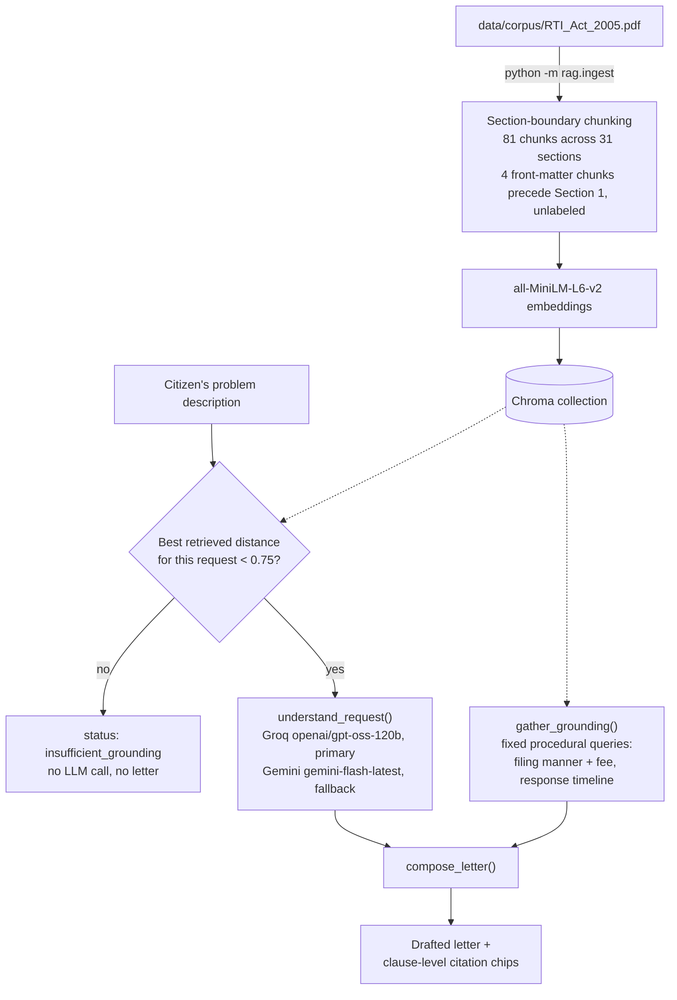

# RTI Sahayak

Drafts a Right to Information Act, 2005 application for a citizen's problem, citing the
exact Act sections that justify each procedural claim, and refuses to draft when the Act's
text doesn't confidently cover the request.

**Demo video:** [add link here]

## The problem

Filing an RTI application means citing specific sections of a 20-year-old statute correctly,
and most citizens have never read it. Get the procedure wrong — the wrong fee, a missing
citation, the wrong Public Information Officer — and the application can be rejected or
delayed on a technicality that has nothing to do with the actual grievance. There's no
easy way for someone with a genuine complaint to check, before filing, whether their
request is even phrased the way the Act expects.

## Screenshot

A generated draft, with clause-level citation chips (linking each procedural sentence back
to the Act section that justifies it) and the retrieved source passages shown below:


## What it does

1. The citizen fills in a short form: name, address, locality, time period, what happened,
   and optionally the public authority or PIO designation if already known.
2. On submit, the backend first checks whether anything in the RTI Act corpus is actually
   relevant to the citizen's own problem description (see "the insufficient-grounding
   guard" below). If nothing clears the bar, it stops here — no letter, no LLM call.
3. Otherwise, an LLM turns the free-text problem into a short list of specific things to
   request ("information sought") and a best-guess public authority — always labeled as a
   guess, never presented as fact.
4. The procedural boilerplate (filing manner, fee, response timeline) is assembled in plain
   Python, not by the LLM, and only included after checking the underlying fact-keywords are
   actually present in retrieved Act text — see "clause-level provenance" below.
5. The composed letter is rendered with inline citation chips; clicking one scrolls to and
   highlights the source passage that backs it. The citizen can copy the text, download a
   PDF, or print just the letter (not the page chrome).

## How it works



- **Ingestion.** `rag/ingest.py` splits the Act's text on detected section headings, not on
  a fixed word count — every chunk belongs to exactly one section by construction, never
  inferred from where a sliding window happened to land. A section longer than ~1800
  characters is sub-split into ~1200-character pieces that all keep that section's label.
  This produces 81 chunks covering all 31 sections; 4 chunks are the front matter (title
  page, notification text) before Section 1 is detected, and carry no section label.
- **Retrieval.** `rag/retriever.py` queries the Chroma collection and discards anything
  with a distance above `MAX_RELEVANT_DISTANCE` (0.75). That threshold was re-measured
  after the section-boundary rewrite changed typical chunk size — see Known limitations.
- **Provider fallback.** `llm/client.py` tries whichever provider `LLM_PROVIDER` names
  first (`.env.example` ships `groq`, model `openai/gpt-oss-120b`) and automatically
  retries on the other provider (`gemini`, `gemini-flash-latest`) if the primary raises.
  This isn't just a theoretical code path: it fired for real during testing when Gemini
  returned `503 UNAVAILABLE` ("model is currently experiencing high demand"), and the
  fallback still delivered a complete, correctly-cited draft via Groq.
- **Clause-level provenance.** `agent/drafter.py`'s `build_procedural_clauses()` links each
  *procedural* clause (the Section 6 filing/fee sentence, the Section 7 response-timeline
  sentence) back to the single retrieved chunk that contains its underlying fact-keywords,
  when one exists. This is scoped precisely to those procedural clauses — the "particulars
  of information sought" and the rest of the letter are LLM-composed prose and are not
  individually cited.
- **Insufficient-grounding guard.** Before calling the LLM at all, `web/api/draft.py` runs
  a retrieval pass on the citizen's own problem description (distinct from the fixed
  procedural queries above, which would pass for any topic). If nothing clears the 0.75
  threshold, it returns `status: insufficient_grounding` immediately — no
  `understand_request()` call, no letter.

## Setup

Verified end-to-end via a clean clone into a fresh directory, fresh venv, and a fresh
`pip install`:

```bash
python -m venv .venv
# Windows: .venv\Scripts\activate      macOS/Linux: source .venv/bin/activate
pip install -r requirements.txt

cp .env.example .env
# edit .env and fill in GROQ_API_KEY and/or GEMINI_API_KEY
```

`LLM_PROVIDER` in `.env` selects the primary provider (`groq` or `gemini`); the other is
used automatically as a fallback. See `.env.example` for every variable the app reads.

Build the knowledge base (not committed — see Project structure):

```bash
python -m rag.ingest
```

This downloads the embedding model on first run and prints `Ingested 81 chunks from 1
PDF(s) ... (77/81 tagged with a section number)`. Re-run it any time the corpus PDF
changes; it deletes and replaces the existing Chroma collection.

Run either front end (both read the same `data/chroma/` index, built above):

```bash
streamlit run app.py                                    # conversational intake
uvicorn web.main:app --host 127.0.0.1 --port 8000        # web UI, http://127.0.0.1:8000
```

The first request after ingestion is slow (roughly 20-50s depending on machine load,
measured runs: 22.25s, 30.83s, 30.94s, 46.26s) while the embedding model
loads into memory — the FastAPI app warms this up at startup before accepting requests;
Streamlit loads it lazily on first use (`st.cache_resource`) and caches it for the life
of the process.

**Troubleshooting (Windows):** if `git clone` fails with `Filename too long`, it's hitting
the 260-character `MAX_PATH` limit — one self-hosted font file has a long, hash-based name.
Clone to a short path (e.g. `C:\rti-sahayak`) or run
`git config --global core.longpaths true`.

## Project structure

```
agent/    intake slot-filling and letter drafting/composition
data/     corpus/ (source PDF, committed) and chroma/ (vector index, gitignored)
design/   Stitch-exported HTML/Tailwind screens the web/ templates were ported from
docs/     README assets (screenshots)
export/   PDF generation
llm/      provider-agnostic LLM client (Groq + Gemini, automatic fallback)
rag/      corpus ingestion (ingest.py) and retrieval (retriever.py)
tools/    one-off dev scripts (self-hosting web fonts)
web/      FastAPI app, routes, and Jinja2 templates
app.py    Streamlit interface over the same agent/llm/rag/export pipeline as web/
```

## Scope

| | |
|---|---|
| **Implemented** | Conversational intake (Streamlit) and one-shot web form (FastAPI); section-grounded letter drafting with clause-level citations; insufficient-grounding refusal; PDF export; Browse the Act (real section list + search over the corpus); system telemetry panel; Groq/Gemini provider fallback |
| **Not implemented** | **Track** (filing status and statutory deadline tracking) and **Ask** (standalone Q&A over the Act) are stubbed to a "coming soon" page, not built. **Multilingual drafting** (हिंदी / मराठी) shows an inline "in development" note where clicked — no translation happens. |

## Known limitations

- The grounding threshold's separation margin is narrow: measured on-topic queries reach
  a worst-case distance of 0.734, and measured off-topic queries bottom out at 0.778. A
  0.75 threshold sits in that gap, but it's a ~0.04 margin on each side — a borderline
  query could misclassify either direction.
- `rag/retriever.py` imports `streamlit` and uses `st.cache_resource` to cache the loaded
  collection, a pattern built for the Streamlit app. Called from FastAPI, this still works
  but logs a `missing ScriptRunContext` warning to stderr on every process start — cosmetic,
  not functional.
- `gemini-flash-latest` is a reasoning model that spends part of `max_output_tokens` on
  internal reasoning before producing visible output. A low token budget can be entirely
  consumed by reasoning, returning empty text with no error — observed directly with a
  20-token budget. The app's actual budgets are large enough that this hasn't shown up in
  practice, but it's a real characteristic of the model, not handled defensively in code.
- The letter's public-authority line is an LLM guess, not a verified fact — it's always
  rendered with "(Best guess — please verify the correct office before submitting.)" in the
  output. Citizens still need to confirm the correct office before filing.
